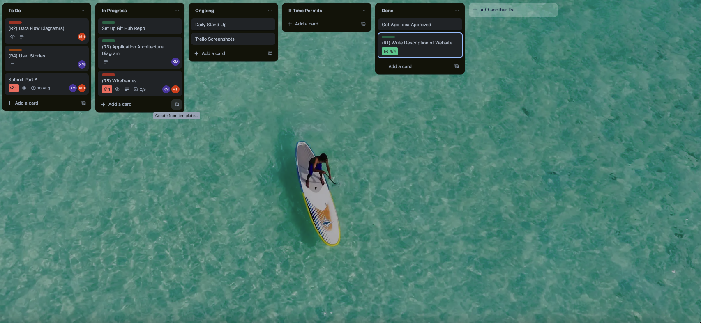

# T3A2-Full-Stack-App

## Table of Contents

- [Description](#description)
- [Dataflow Diagram](#dataflow-diagram)
- [Application Architecture Diagram](#application-architecture-diagram)
- [User Stories](#user-stories)
- [Wireframes](#wireframes)
- [Trello](#trello)

## Description

### Purpose

Company name is an activity rental stand located on the Gold Coast. Currently they do not have a website and as a result rely on a manual/paper booking system when people book in person. Not only do they rely on customers physically seeing the stand in order to make a booking, they have found that they have been leaving some customers disappointed as the equipment they came to hire was not available for them to use. As a result, they have asked us to create a website that allows their customers to view and book equipment in advance and additionally allows them to keep track of their bookings for each day. They believe that having a website where customers can see the equipment on offer and book online in advance, will not only increase their revenue but also increase the satisfaction of their customers.

### Functionality/Features

#### User Login and Registration Functionality

The app will allow users to register their details so that this information can be linked to their booking. Robust authentication procedures will be utilised to ensure confidentiality and security of user accounts. Users will have the ability to login to their account allowing them to view their past/upcoming bookings and make any required modifications (update/delete booking).

#### Equipment Listing

The application will have an equipment listing feature that will allow users to see all of the equipment they are able to hire. Users will be able to see a picture of the equipment, read a description, see a price and their hiring options (e.g. 1hr, 2hrs, full day etc.)

#### Booking System

Users have the ability to book a piece of equipment that they want to hire. In addition to selecting the length of time they want to hire a piece of equipment, this feature will allow users to select a specific date and time

#### Admin Functionality

The admin of this application will be able to view all of the bookings that have been made by users, allowing them to prepare the necessary equipment. In addition to this, the admin will have the ability to add, update or delete the equipment available for hire.

#### Target Audience

The application will be targeted at members of the general public looking for an activity on the Gold Coast. The web application is strategically designed to cater to a diverse audience with varying needs and preferences. It is accessible and user friendly for individuals of all backgrounds and abilities. Whether the user is a local Gold Coast resident, or an international visitor, the web application ensures an intuitive navigation to ensure seamless access equipment hire.

#### Tech Stack

- JavaScript
- Node.js
- Express.js
- MongoDB
- React
- Cloudinary

## Dataflow Diagram

## Application Architecture Diagram

Users access the application through various devices with different screen sizes and capabilities. The front-end is designed to be responsive, ensuring a consistent user experience across all devices. The UI is built using React.js, which manages the rendering of views and handles user interactions. The UI is responsive, adapting to various device types. It uses modern CSS frameworks for styling and supports component-based architecture for reusability. The backend is implemented using  MongoDB serves as the NoSQL database where data is stored in a document-oriented format (JSON-like). Mongoose is used to define schemas, enforce data validation, and facilitate interaction with the database through models.Node.js and Express.js. It handles business logic, processes incoming requests, and communicates with the database.

## User Stories

## Wireframes

## Trello

### [Link to Trello Board](https://trello.com/b/rG8J0pFg/t3a2-full-stack-app)

#### This is what it currently looks like as of **13/08/2024**. More features may be added

