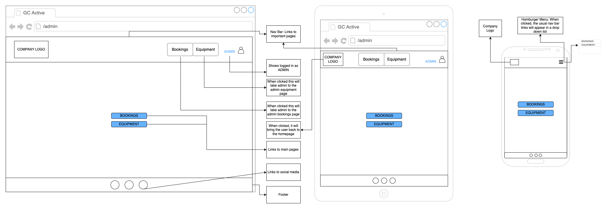

# T3A2-Full-Stack-App

## Table of Contents

- [Description](#description)
- [Dataflow Diagrams](#dataflow-diagrams)
- [Application Architecture Diagram](#application-architecture-diagram)
- [User Stories](#user-stories)
- [Wireframes](#wireframes)
- [Trello](#trello)

## Description

### Purpose

Company name is an activity rental stand located on the Gold Coast. Currently they do not have a website and as a result rely on a manual/paper booking system when people book in person. Not only do they rely on customers physically seeing the stand in order to make a booking, they have found that they have been leaving some customers disappointed as the equipment they came to hire was not available for them to use. As a result, they have asked us to create a website that allows their customers to view and book equipment in advance and additionally allows them to keep track of their bookings for each day. They believe that having a website where customers can see the equipment on offer and book online in advance, will not only increase their revenue but also increase the satisfaction of their customers.

### Functionality/Features

#### User Login and Registration Functionality

The app will allow users to register their details so that this information can be linked to their booking. Robust authentication procedures will be utilised to ensure confidentiality and security of user accounts. Users will have the ability to login to their account allowing them to view their past/upcoming bookings and make any required modifications (update/delete booking).

#### Equipment Listing

The application will have an equipment listing feature that will allow users to see all of the equipment they are able to hire. Users will be able to see a picture of the equipment, read a description, see a price and their hiring options (e.g. 1hr, 2hrs, full day etc.)

#### Booking System

Users have the ability to book a piece of equipment that they want to hire. In addition to selecting the length of time they want to hire a piece of equipment, this feature will allow users to select a specific date and time

#### Admin Functionality

The admin of this application will be able to view all of the bookings that have been made by users, allowing them to prepare the necessary equipment. In addition to this, the admin will have the ability to add, update or delete the equipment available for hire.

#### Target Audience

The application will be targeted at members of the general public looking for an activity on the Gold Coast. The web application is strategically designed to cater to a diverse audience with varying needs and preferences. It is accessible and user friendly for individuals of all backgrounds and abilities. Whether the user is a local Gold Coast resident, or an international visitor, the web application ensures an intuitive navigation to ensure seamless access equipment hire.

#### Tech Stack

- JavaScript
- Node.js
- Express.js
- MongoDB
- React
- Cloudinary

## Dataflow Diagrams

### Representation Explanation

**Process:** This refers to the actions carried out, such as user registration, booking creation, etc.

**Input Data:** This is the information provided by the user or admin, such as login credentials or booking details.

**Data Store Accessed/Updated:** This indicates which data store is being accessed or updated due to the process.

**Output Data:** This is the result of the process, such as a confirmation message or a list of equipment.

### User Authentication

#### 1.0 User Authentication

1.1 Registration:

- **Input:** User Registration Data
- **Output:** Confirmation to User
- **Data Store:** User Data Store

1.2 Login/Authorisation:

- **Input:** Login Credentials
- **Output:** Authorisation Response
- **Data Store:** User Data Store

### Equipment Management

#### 2.0 Equipment Management

2.1 List Equipment:

- **Input:** Equipment Request
- **Output:** Equipment List to User/Admin
- **Data Store:** Equipment Data Store

2.2 Add Equipment (Admin):

- **Input:** New Equipment Data
- **Output:** Confirmation to Admin
- **Data Store:** Equipment Data Store

2.3 Update Equipment (Admin):

- **Input:** Updated Equipment Data
- **Output:** Confirmation to Admin
- **Data Store:** Equipment Data Store

2.4 Delete Equipment (Admin):

- **Input:** Equipment ID
- **Output:** Confirmation to Admin
- **Data Store:** Equipment Data Store

2.5 Image Upload (Admin):

- **Input:** Image File
- **Output:** Image URL stored in Equipment Data Store
- **Data Store:** Cloudinary (External Service) and Equipment Data Store

### Booking Management

#### 3.0 Booking Management

3.1 Create Booking:

- **Input:** Booking Details
- **Output:** Confirmation to User
- **Data Store:** Booking Data Store

3.2 Update Booking:

- **Input:** Updated Booking Data
- **Output:** Confirmation to User
- **Data Store:** Booking Data Store

3.3 Delete Booking:

- **Input:** Booking ID
- **Output:** Confirmation to User
- **Data Store:** Booking Data Store

3.4 View Hire Log (Admin):

- **Input:** Log Request
- **Output:** Hire Log Data to Admin
- **Data Store:** Booking Data Store

## Application Architecture Diagram

Users can access the application through various devices with different screen sizes and capabilities. The front-end is designed to be responsive, ensuring a consistent user experience across all devices. The UI, deployed on Netifly, is built using React.js, which manages the rendering of views and handles user interactions. The UI is responsive, adapting to various device types. It uses modern CSS frameworks for styling and supports component-based architecture for reusability. The backend, deployed on Atlas, is implemented using MongoDB serves as the NoSQL database where data is stored in a document-oriented format (JSON-like). Mongoose is used to define schemas, enforce data validation, and facilitate interaction with the database through Express.js. The back-end web server is deployed on render and handles business logic, processes incoming requests, and communicates with the database.

## User Stories

Before creating the wireframes which mapped the app’s specific features, it was important to understand who would be using our app, why they are using our app, and the minimum requirements our app must meet. As a result, we utilised user stories in order to help define the scope of the features and functionalities that our application required.

In order to establish the basic features of the app, we initially created user stories for a general ‘user’ and ‘admin’. However, these initial user stories did not have any distinguishing factors between users other than if they were registered or not. As a result, we went through and revised these user stories to give more of a ‘persona’ to each of the users. We found that by doing this, the why behind each user story became more clear and allowed us to have a better understanding of what features needed to be put in place.

In addition to this, as we progressed through the rest of the project and started to create wireframes that implemented these features, we found that we were either missing user stories that reflected the use of key features, or some of our user stories were quite broad and could be refined in order to better reflect the features of the app. By refining our user stories to better reflect the proposed features of our app we were able to gain a deeper understanding of the importance of each feature and who out of our target audience would be utilising it.

### Un-registered User

| **User Story**                                                                                                                                     | **Priority** | **Accept/Reject** |
| -------------------------------------------------------------------------------------------------------------------------------------------------- | ------------ | ----------------- |
| As a user looking to hire some equipment, I want to be able to view all of the equipment available to hire so that I can make the decision to register and book or not. | High         | Accept            |
| As a user looking to hire an item for a specific length of time, I want to be able to view all of the hire options (length of hire) so that I can make the decision to register and book or not. | High         | Accept            |
| As a user looking for the best price, I want to be able to view the price of hiring equipment so that I can make the decision to register and book or not. | High         | Accept            |
| As a busy person I want to be able to book equipment online so that I don’t have to call or book in person.                                          | High         | Accept            |
| As a user with a specific date in mind, I want to be able to select a date and time for my booking so that the equipment selected is available when I need it. | High         | Accept            |
| As a user booking equipment for me and my family, I want to be able to select multiple bikes at a time so that I don’t have to individually book 3 bikes. | Medium       | Accept            |
| As an international tourist, I want to be able to use and understand the application so I can successfully make a booking on my holiday.             |              |                   |
| - **Refinement 1:** As an international tourist that cannot read English very well, I want to clearly see pictures of each piece of equipment available so that I can accurately select what I want to hire. | High         | Accept            |
| - **Refinement 2:** As an international tourist I want to be able to change the language settings so that I can read in my own language.              | Low          | Reject            |
| - **Refinement 3:** As an international tourist I want to be able to change the price to show in my own currency so that I have a better understanding of how much it will cost. | Low          | Reject            |
| As a user with limited technical proficiency, I want to be able to navigate the website with ease so that I am able to make a booking.               | Medium       | Accept            |
| As a user that only has a phone and not an iPad or laptop, I want to be able to have full functionality so that I can still make a booking.          | High         | Accept            |

### Registered User

| **User Story**                                                                                                                                     | **Priority** | **Accept/Reject** |
| -------------------------------------------------------------------------------------------------------------------------------------------------- | ------------ | ----------------- |
| As a frequent user I want to be able to register my details so that I do not have to enter my personal details multiple times.                      | Medium       | Accept            |
| As a registered user with a booking, I want to be able to view my booking, so that I can ensure the details are correct.                            |              |                   |
| - **Refinement 1:** As a registered user with a booking, I want to be able to view all of the relevant details so that I can remember the equipment, date, time, quantity, and price of my booking. | Medium       | Accept            |
| - **Refinement 2:** As a registered user with a change of plans, I want to be able to update or delete my booking online to a new date that suits.  | High         | Accept            |

### Admin User

| **User Story**                                                                                                                                     | **Priority** | **Accept/Reject** |
| -------------------------------------------------------------------------------------------------------------------------------------------------- | ------------ | ----------------- |
| As an admin I want to be able to view a complete list of the bookings made so that I can have a history of our transactions.                        | High         | Accept            |
| As an admin I want to be able to add/update/delete bookings so that I can also manually enter bookings from in-person customers.                    | Medium       | Accept            |
| As an admin, I want to be able to update the details of equipment so that their descriptions, availability, and price remain up to date.            | High         | Accept            |
| As an admin I want to be able to add new equipment so that we can offer more equipment as we expand.                                                | High         | Accept            |
| As an admin I want to be able to filter bookings so that I can see the bookings for today and I can prepare the appropriate equipment.              | Medium       | Accept            |
| As an admin I want to be able to grant admin privileges so that if my business grows I can have multiple admins.                                    | Low          | Reject            |

## Wireframes

### Landing/Homepage

### Price Page

### Equipment Page

### Booking Details Page

### Manage Booking Page

### Update Booking Page

### Register(New User) Page

### Sign In Page

### Admin Homepage

### Admin Bookings Page

### Admin Equipment Page

### Admin Add Equipment Page

## Trello

### Full Trello Board can be viewed [here.](https://trello.com/b/rG8J0pFg/t3a2-full-stack-app)

#### Initial Trello Board (13/08/2024)

#### Trello Board Halfway Through Part A (15/08/2024)

#### Trello Board at End of Part A (18/08/2024)

